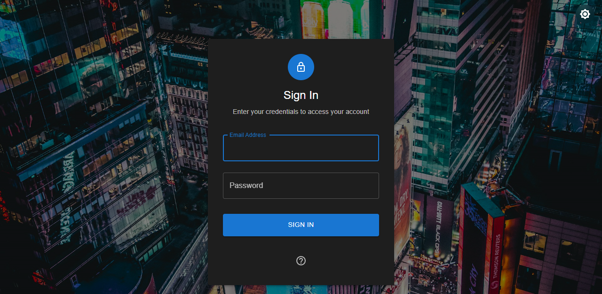
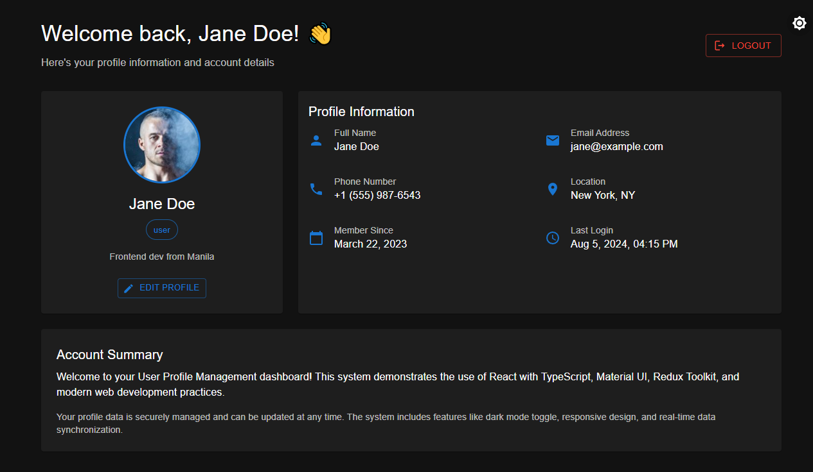

# User Profile Management System

A responsive, interactive frontend for a User Profile Management system built with React, TypeScript, and modern web technologies.




## 🚀 Features

- **Authentication System**: Secure login with email and password, complete with validation using Formik and Yup.
- **Dynamic Profile Dashboard**: View and manage user profile information in a clean, modern interface.
- **Edit Profile Functionality**: Update user details, including name, email, bio, and avatar, through a sleek modal form.
- **Redux State Management**: Centralized and predictable state management powered by Redux Toolkit.
- **Protected Routes**: Secure application routes based on user authentication status.
- **Material UI**: A beautiful and responsive UI built with a rich set of Material UI components.
- **TypeScript**: End-to-end type safety for a more robust and maintainable codebase.
- **Mock API**: A simulated backend that mimics real API behavior for a complete development experience (no external libraries needed).
- **Responsive Design**: A fully responsive layout that works seamlessly on both desktop and mobile devices.

## 🚀 Getting Started

### Prerequisites

- Node.js (version 14 or higher)
- npm or yarn

### Installation

1. Clone the repository:
```bash
git clone <repository-url>
cd ark-profile-management
```

2. Install dependencies:
```bash
npm install
```

3. Start the development server:
```bash
npm start
```

4. Open [http://localhost:3000](http://localhost:3000) to view it in the browser.

## 🔐 Demo Credentials

The application includes mock user data for testing:

- **Admin User**:
  - Email: `admin@example.com`
  - Password: `admin123`

- **Regular User**:
  - Email: `jane@example.com`
  - Password: `user123`

## 📱 Features Overview

### Login Page
- Secure login form with email and password fields.
- Client-side validation using Formik and Yup.
- Loading indicators and disabled state during authentication.
- Clear error feedback for invalid credentials.
- Handy popover with demo credentials for easy testing.
- Fully responsive design using Material UI components.

### Dashboard Page
- Detailed user profile information display, including avatar, bio, and personal details.
- Prominent logout button to securely end the session.
- Access restricted to authenticated users via a protected route.
- Interactive "Edit Profile" modal to update user information.
- Success notifications for profile updates.
- Clean, responsive layout for an optimal viewing experience on any device.

### State Management (Redux Toolkit)
- Centralized state management for user, profile, and authentication status.
- Token-based session handling with `localStorage`.
- Manages async thunks for login, logout, profile fetching, and profile updating.
- Robust handling of loading and error states across the application.

## 🔧 Available Scripts
